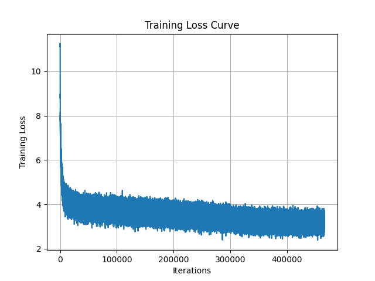
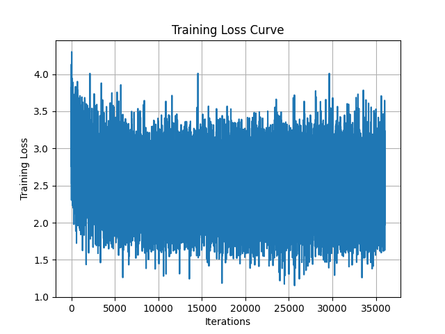

# mini-llama3-from-scratch
本项目旨在从零实现一个迷你版llama3，并进行预训练和微调。
相关理论参考：https://blog.csdn.net/m0_55846238/article/details/145728695?spm=1001.2014.3001.5501

## 1. 配置环境
```
pip install -r requirements.txt
```

## 2. 下载数据
使用 https://github.com/DLLXW/baby-llama2-chinese 的经过预处理的语料。

预训练选择wiki、medical、baidubaike三个文件夹的语料，大约7GB多一点。

微调使用alpaca-zh、bell。

讲数据放入data文件夹，项目结构具体如下：
```
D:\CODE\手撕LLAMA3
│  config.py
│  dataset.py
│  example.mp4
│  pretrain.py
│  requirements.txt
│  run_model.py
│  sft.py
│
├─chatglm_tokenizer
│      tokenization_chatglm.py
│      tokenizer.model
│      tokenizer_config.json
│
├─data
│  │  baidubaike_563w_1.bin
│  │  baidubaike_563w_2.bin
│  │  baidubaike_563w_3.bin
│  │  baidubaike_563w_4.bin
│  │  baidubaike_563w_5.bin
│  │  medical_book.bin
│  │  medical_encyclopedia.bin
│  │  procees_data.py
│  │  wiki.bin
│  │
│  ├─pretrain_data
│  │      pretrain_data.bin
│  │
│  └─sft_data
│          alpaca_gpt4_data_zh.json
│          Belle_open_source_1M.json
│          sft_data.csv
│
├─model
│  │
│  └─llama.py
│
└─results
    ├─pretrain_model_max_seq_256_params_274.3M
    │      pretrain_model_max_seq_256_params_274.3M.pth
    │      pretrain_model_max_seq_256_params_274.3M_config.yaml
    │      pretrain_model_max_seq_256_params_274.3M_loss.png
    │
    └─sft_model_max_seq_256_params_274.3M
            sft_model_max_seq_256_params_274.3M.pth
            sft_model_max_seq_256_params_274.3M_config.yaml
            sft_model_max_seq_256_params_274.3M_loss.png
```
进入`data`文件夹，根据需要使用`procees_data.py`来预处理数据

## 3. 预训练
在`config.py`中修改配置，运行
```
python pretrain.py
```
结果会保存在`results`文件夹中。

## 4. 微调
由于模型参数量较少，使用全部参数进行微调。

在`config.py`中修改配置，运行
```
python sft.py
```
结果会保存在`results`文件夹中。

## 5. 使用模型
填入模型名称、路径等，运行
```
python run_model.py
```

## 6. 结果
预训练在24GB显存的单卡4090上训练一个epoch大约不到48小时。

模型整体参数量较小，使用的数据量也不多，效果如下：

演示视频：

https://github.com/user-attachments/assets/3ab4700b-c1e3-4225-9316-f050cad87c71

预训练损失曲线：



微调损失曲线：




